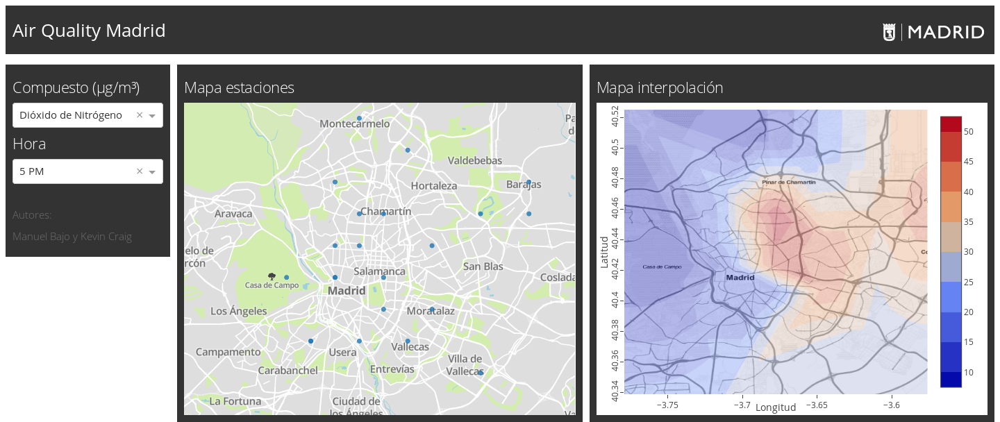

# AQ-Madrid

Mapas de la contaminación en Madrid a tiempo real.

Autores: Manuel Bajo Buenestado y Kevin Craig Alisauskas.

En este proyecto se ha realizado una aplicación web utilizando Dash. La aplicación muestra unos mapas de contaminación en Madrid con datos a tiempo real, obtenidos del [Portal de Datos Abiertos del Ayuntamiento de Madrid](https://datos.madrid.es/portal/site/egob/menuitem.c05c1f754a33a9fbe4b2e4b284f1a5a0/?vgnextoid=41e01e007c9db410VgnVCM2000000c205a0aRCRD&vgnextchannel=374512b9ace9f310VgnVCM100000171f5a0aRCRD&vgnextfmt=default).

## Datos

Se ha creado una función "generar_datos" dentro de un fichero "import_data.py" con el que se procede a la descarga de los dos ficheros necesarios, el de datos y el de estaciones, y la adaptación de los mismos en forma de dataframe con los valores de interés, las estaciones, y las coordenadas de latitud y longitud ya en el formato necesario para su ejecución con Dash. Si la aplicación se mantiene abierta busca los últimos datos disponibles cada media hora y actualiza la información mostrada en los mapas.

## Mapas

El mapa de la derecha muestra un contourplot de la contaminación del compuesto indicado sobre un mapa de Madrid estático. Para realizarlo, se utilizan los puntos medidos de cada estación para triangulizar el espacio sobre el mapa y realizar una interpolación suave dentro de cada triángulo utilizando los datos de las medidas en sus esquinas. De esta manera se calculan los valores estimados de la contaminación en Madrid sobre una red de puntos equiespaciados en el espacio, que se representan mediante un contourplot interactivo de Plotly. Si se sitúa el puntero del rantón sobre el mapa, obtenemos el valor estimado de la contaminación para una latitud y longitud dada.

El mapa que se muestra a la izquierda se trata de un mapa interactivo, que utiliza un proveedor de mapas online (Mapbox) y realiza un scatter plot sobre él usando a plotly. Cada punto azul del mapa indica la posición en el mapa de una estación, que mide el compuesto indicado. Si se sitúa el puntero del ratón sobre uno de estos puntos, se muestran el nombre de la estación y la medida del contaminante indicado realizada por esta.

